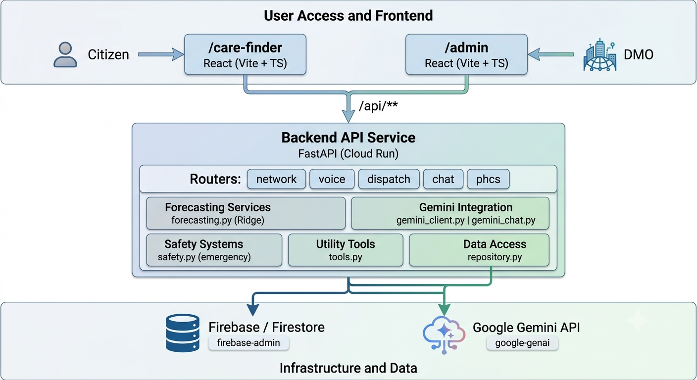

# HealthGrid AI

Federated health-resource and supply-chain platform for India's Primary Health Centres (PHCs). Built for the Smart Health track.

> **All numbers in this project are synthetic demo data.** Facility names and districts are real; beds, doctors, stock and footfall are invented. Coordinates are approximate.

## What it does

| Audience | Feature |
|---|---|
| **Citizens** | **Care Finder**: a Gemini chatbot (English, Hindi, Kannada, Marathi; text or voice) that finds the nearest PHCs and answers questions about medicine availability, beds and doctor presence. |
| **DMO / Admin** | **Command center**: KPIs, stock-out forecasts per PHC and medicine, AI-written redistribution briefs with a preview-then-approve dispatch flow, and multilingual voice or text daily reports that update the network. |

## Architecture




Key decisions:

1. **The browser never touches Firestore.** Security rules are deny-all; only the backend uses the Admin SDK. `repository.py` is the only module that imports `firebase_admin`.
2. **The chatbot uses Gemini function calling.** Gemini picks a tool, the backend runs it on Firestore, and Gemini answers only from the tool results. UI cards are built from tool data, not from the model's prose.
3. **Deterministic numbers, LLM language.** Forecasts, distances, availability levels and transfer quantities are computed in Python and always override the model.
4. **Mock fallbacks everywhere.** With no `GEMINI_API_KEY`, or if Gemini fails, responses are rule-based and labelled `"source": "mock"`.
5. **Privacy.** User coordinates are used per request only. They are never stored or logged, and are never sent to Gemini (the backend injects them into tool calls).
6. **Safety.** Emergency phrases in four languages short-circuit to a fixed 108/112 message before any LLM call, and are never rate limited.

## Tech stack

React 18 + Vite + TypeScript + Bootstrap 5 · FastAPI · Firebase Firestore (asia-south1) · Gemini via `google-genai` · scikit-learn (Ridge) · Web Speech API · Cloud Run + Firebase Hosting.

## Firestore schema

```
phcs/{phc_id}                  phc_name, district, state, location (GeoPoint), beds_*, doctors_*, updated_at
inventory/{phc_id}__{slug}     phc_id, medicine_name, current_stock, footfall_history[7], updated_at
daily_reports/{auto}           phc_id, transcript, language, extracted{}, source, created_at
transfers/{auto}               item, source_phc_id, target_phc_id, quantity, brief{}, source, created_at
```

## Forecasting

Ridge regression (alpha 1.0) on the 7-day footfall history predicts the next 7 days. Each day is multiplied by a per-medicine usage rate, and stock is walked forward to get `days_to_stockout`.

- CRITICAL: under 3 days · WARNING: under 7 days · GREEN: otherwise.
- Donor surplus = stock − 10 × donor avg daily demand.
- Transfer quantity = min(donor surplus, 10 × target avg demand − target stock), computed in code.

## Setup

Requirements: Python 3.10+, Node 20+, a Firebase project (Firestore in Native mode) and a Gemini API key.

```bash
# 1. Backend config
cd backend
cp .env.example .env          # set GOOGLE_APPLICATION_CREDENTIALS, GEMINI_API_KEY, GEMINI_MODEL
python -m venv .venv && .venv\Scripts\activate    # macOS/Linux: source .venv/bin/activate
pip install -r requirements.txt

# 2. Seed Firestore (idempotent; 12 phcs and 72 inventory docs)
cd .. && python scripts/import_to_firestore.py

# 3. Run the API
cd backend && uvicorn app.main:app --reload

# 4. Run the frontend (new terminal)
cd frontend && npm install && npm run dev      # http://localhost:5173
```

Never commit `serviceAccountKey.json` or `.env`. Firestore rules must deny all client access.

Tests: `pytest -v` in `backend/`, `npm run typecheck` in `frontend/`.

## API

| Method | Path | Purpose |
|---|---|---|
| GET | `/api/health` | Health check and AI mode |
| GET | `/api/v1/network-status` | KPIs and per-PHC inventory with forecasts |
| POST | `/api/v1/log-daily-voice-report` | Extract data from a report and update Firestore |
| POST | `/api/v1/recommend-redistribution` | Brief for a transfer. `preview: true` computes without saving; `false` saves |
| GET | `/api/v1/transfers` | Recent transfers |
| GET | `/api/v1/phcs/nearby` | Nearest PHCs by distance |
| POST | `/api/v1/chat` | Citizen chatbot (rate limited to 20 requests/min per IP) |

## Chatbot design

- **Tools:** `find_nearest_phcs`, `get_medicine_availability`, `get_phc_details`, `list_phcs_by_district`. Medicine names are fuzzy-matched ("dolo" and "PCM" resolve to Paracetamol 500mg).
- **Availability levels only.** Citizens see IN_STOCK, LOW or OUT, never exact counts. Stock 0 is OUT; CRITICAL or WARNING is LOW; GREEN is IN_STOCK.
- **Not a doctor.** No diagnosis or dosing. Serious cases are pointed to a facility with a doctor, 108 or 112.
- **Fallback.** If Gemini fails, a rule-based mock answers with the same tools and cards.

## Limitations

- Synthetic data, not connected to HMIS or e-Aushadhi.
- Distances are straight-line, not road distances.
- No authentication on `/admin` yet.
- Voice input uses the browser Web Speech API (Chrome or Edge); Kannada and Marathi accuracy varies.
- The forecast is a linear trend over 7 points.
- The rate limiter is in-memory, per instance.
- Approving a transfer does not yet reduce stock.

## Roadmap

Firebase Auth for `/admin` · Vertex AI forecasting · e-Aushadhi / HMIS integration · Cloud Speech-to-Text · PWA and offline mode for ASHA workers · road-distance routing · stock updates on approved transfers.

